# Foulab Backup Infrastructure

Foulab has a large number of servers and devices which provide essential services to the organization: the website, Mattermost server, door unlocking, wifi network, etc. This describes the backup infrastructure used for all these servers and devices ("clients").

- [Objective](#objective)
- [Types of Machines](#types-of-machines)
- [Requirements](#requirements)
- [Overview](#overview)
- [Snowflakes](#snowflakes)
- [cinderblock.lab](#cinderblocklab)
- [wifi.lab](#wifilab)
- [Installation](#installation)
- [Monitoring](#monitoring)

## Objective

The main goal of the backup system is to prevent (permanent) data loss and minimize time to recovery in the following cases:

1. Hardware failure. Example: [in February 2025, the firewall (cinderblock) hard disk failed](https://test.foulab.org/foulab/pl/9ik7ra1cnfy8be7qsucqo4qsgy). It took multiple weeks of work to fully recover the configs/data from the failed disk.
1. Accidental data deletion. eg. sysadmin accidentally deleting data, misconfiguring a server or needing to refer back to a previous state of a server.
1. Rogue sysadmin. An individual with privileged access intentionally causing damage to services. Example: in August 2023 this happened and multiple members spent multiple month recovering Mattermost data, foubot and foudoor.

It is explicitly **not** a goal to extremely minimize downtime. Recovery in ~days to ~weeks is perfectly reasonable. Refer to [Foulab infrastructure criticality ladder](https://docs.google.com/spreadsheets/d/16Wx7gbZvgFtpRHCYDKtoQmxhtaoqm_WEGN_3NtaKFVU/edit).

## Types of Machines

Foulab runs on many types of machines, operating systems and hardware resources (see [Lab Network](https://laboratoires.foulab.org/w/tiki-index.php?page=Lab+Network)). The backup system must be compatible with all of these devices, with as much common design / infrastructure as possible.

<!-- https://www.tablesgenerator.com/markdown_tables -->

| **Device**      | **Type**         | **Operating System**          | **Hardware Resources**            | Approx size of full backup | Approx size of incremental backup |
| --------------- | ---------------- | ----------------------------- | --------------------------------- | -------------------------- | --------------------------------- |
| foulab.org      | VPS (off-site)   | Debian Linux                  | x86, mid-range                    | 6 GB                       | 1 GB                              |
| test.foulab.org | VPS (off-site)   | Debian Linux                  | x86, mid-range                    | 72 GB                      | 1 GB                              |
| manning.lab     | Physical machine | Debian Linux                  | x86, mid-range                    | 22 GB                      | 2 GB                              |
| bahamut.lab     | Physical machine | Debian Linux (OpenMediaVault) | x86, mid-range                    | 10 GB                      | 1 GB                              |
| foubot.lab      | Physical machine | Debian Linux                  | arm64, low power (Raspberry Pi)   | 7 GB                       | 1 GB                              |
| foudoor.lab     | Physical machine | Debian Linux                  | arm, low power (Beaglebone)       | 3 GB                       | 1 GB                              |
| wifi.lab        | Physical machine | OpenWrt Linux                 | mips, very low power (128 MB RAM) | 0.1 GB                     | n/a                               |
| cinderblock.lab | Physical machine | FreeBSD (OPNsense)            | x86, mid-range                    | 60 GB                      | 1 GB                              |

## Requirements

- **Redundancy**: There should be two separate copies of the backup data. Also, if one backup server is down, the backup process should continue uninterrupted on the other server.
- **Data security**: data should be encrypted in transit and at rest. If any of the machines involved (clients or backup servers) are compromised, the attacker should not be able to decrypt past backups.
- **Operational security**: only enrolled servers and devices should be able to upload backups.
- **Efficiency**: backup system should avoid uploading large amounts of duplicate data. For example, uploading all 72 GB of `test.foulab.org` each time would be very inefficient. Some small reasonable amount of duplicate upload (eg. same 10 MB every day) is fine.

## Overview

```mermaid
flowchart LR
    subgraph server1
        direction BT
        nginx1["nginx"]
        htpasswd1["htpasswd"]
        htpasswd1-->nginx1
    end
    subgraph server2
        direction BT
        nginx2["nginx"]
        htpasswd2["htpasswd"]
        htpasswd2-->nginx2
    end
    subgraph systemd_timer["systemd timer / service unit"]
        direction LR
        duplicity
    end
    subgraph duplicity
        direction LR
        delta-->compress-->encrypt-->upload
    end
    subgraph client["client (server/device)"]
        direction LR
        filesystem-->duplicity
        public_key-->encrypt
        public_key["GPGSM public key 🔑"]
        systemd_timer
    end
    subgraph offline
        private_key["GPGSM private key 🔑"]
    end
    firewall1["firewall"]
    firewall2["firewall"]
    upload-->|WebDAV|firewall1-->server1
    upload-->|WebDAV|firewall2-->server2
```

<!-- https://mermaid.js.org/syntax/flowchart.html -->

The backup system is primarily built around the [duplicity](https://en.wikipedia.org/wiki/Duplicity_(software)) open-source backup software, which provides **full and incremental backups**, **encryption** and **remote backups**.

duplicity is based on simple Unix file formats and tools (eg. rsync, tarballs and gpg), and written in Python, which makes it easy to understand, debug and modify.

1. Each client has a `systemd` timer to trigger the process on a schedule, keep logs, and contain the process (set I/O priority, security hardening).

1. Timers have two schedules:
  
    1. **Once a month:** `duplicity` performs a `full` backup. It captures all files on the root filesystem and stores metadata (signatures) that allow it to detect changed files in the future.
    
    1. **Every day:** `duplicity` performs an `incremental` backup. It scans the whole root filesystem, but only captures the files which have changed, and only stores the content delta (using the rsync algorithm). Therefore, it efficiently stores only new data, even small changes to large files (eg. log files).

1. `duplicity` groups each set of changes into volumes of 200 MB, then compresses and encrypts them. The encryption is done using `gpgsm`, a variant of `gpg` which uses the standard PKCS#7 / CMS file format (for rationale, see the section below). ([We contributed the `duplicity` support for gpgsm.](https://gitlab.com/duplicity/duplicity/-/commit/8dc698a38a119c12b3160a076959a834cd701e01))

1. Each client machine has a copy of the gpgsm public key, with identifier `eigma@foulab.org`. Only eigma has the corresponding private key, it is stored encrypted on eigma's home machine.

2. `duplicity` uploads all data files (volumes) and metadata files (signatures, manifest) using WebDAV to **two** locations: one is the deaddrop at Foulab (`backup.foulab.org` aka `bahamut.lab`), the other at eigma's home (`foulab-backup.nanobit.org`). The upload succeeds if at least one mirror uploads successfully. (We contributed bugfixes to `duplicity`'s [WebDAV backend](https://gitlab.com/duplicity/duplicity/-/commit/7c449f84dcf7392b899735ee3875a78ae29d5ea2) and [backup mirror logic](https://gitlab.com/duplicity/duplicity/-/commit/503659d1c90ef05c58b3c35795db48284e03a22d).)

The backup servers are fairly standard nginx servers configured as WebDAV servers:

1. Backup servers are configured with IPv6 and all backup traffic is over IPv6. This simplifies configuring firewalls because each machine in the system (each client and both backup servers) have unique global addresses, despite being on internal networks on both sides.

1. Firewalls are configured to allow only the necessary traffic. For example `2602:ffb6:4:590c:f816:3eff:fec6:62e0` (`foulab.org`) is permitted to initiated connections to `2606:6d00:11b:1700:be30:5bff:fef2:8898` (`backup.foulab.org`) port 8084. Other than the machines enrolled in backups, all other connections to `backup.foulab.org` port 8084 are blocked. These firewall rules are configured, for `backup.foulab.org` in the firewall machine `cinderblock.lab`, and for eigma's server, on eigma's home router.

1. We use the standard WebDAV support in nginx, plus the additional `libnginx-mod-http-dav-ext` package. `duplicity` is configured to avoid needing to download any files, so we **prohibit any GET requests**. That means if an attacker compromises one of the client machines, they can't download any backup files. ([The `duplicity` maintainer helped by improving support to avoid downloading metadata files.](https://gitlab.com/duplicity/duplicity/-/commit/ad7c0012e7d01b1d42d00cc4cdd4c2bd0de24138))

1. We use HTTP Basic authentication, and each client has a username:password assigned to it, configured on the client and in each nginx server's htpasswd file. By convention the `${username}` is assigned as the hostname of the client machine. Using nginx rules, each `${username}` is only allowed to `PUT` to a directory also named `${username}`. In case one machine is compromised, this provides some minimal isolation to prevent polluting other directories.

    1. We don't use TLS because it would be annoying to maintain LetsEncrypt TLS certificates for the backup servers which are on internal networks and heavily firewalled; and it would provide very little benefit, considering the backup files are already encrypted.

## Snowflakes

### cinderblock.lab

`cinderblock.lab` (the firewall machine) runs OPNsense, which can't easily run `duplicity`. Also, FreeBSD has built-in filesystem snapshotting (`zfs snapshot`). So the backup client for this machine follows the same concept, but implementation is different:

1. **Once a month / every day:** Take a full/incremental zfs snapshot of the filesystem (from the root, all datasets, recursively). The schedule is configured using [standard OPNsense Cron entries](https://docs.opnsense.org/manual/settingsmenu.html#cron) (System ‣ Settings ‣ Cron). This involves setting up a [custom OPNsense "action"](https://docs.opnsense.org/development/backend/configd.html), see [actions_foulab.conf](actions_foulab.conf), [foulab-backup-opnsense.sh](foulab-backup-opnsense.sh).

1. Serialize the snapshot using `zfs send`, then encrypt using `openssl smime`. This tool uses standard PEM formatted public keys, and produces standard PKCS#7 / CMS file format output. **This is the reason why we modified `duplicity` to support gpgsm, so that we could use PKCS#7 standard encryption across all clients.**
  
1. Upload the encrypted file using `curl`. **This is part of the reason for choosing WebDAV as the upload protocol, because curl is well supported across all our machines, and it can upload over WebDAV.**

In case recovery is needed, the most important data from this machine is the `/conf` OPNsense configuration directory. Because it's tedious to unpack `zfs` streams from Linux, for convenience, there's also a separate backup process that uploads just that directory.

1. Using `tar`, create a tarball of `/conf`.

1. Encrypt using `openssl smime` (as above).

1. Upload using `curl` (as above).

### wifi.lab

`wifi.lab` runs OpenWrt, a flavour of Linux, so in theory it might be able to run `duplicity`. But in reality, it has too little hardware resources to install and run it. So it also uses a custom implementation of the backup process:

1. **Every day:** because the access point's storage is relatively small (~MB), we just take a full backup every day. This is triggered from standard [OpenWrt Cron](https://openwrt.org/docs/guide-user/base-system/cron) and calls the script [foulab-backup-openwrt.sh](foulab-backup-openwrt.sh). But there are two flavours of backups:

    1. **sysupgrade config backup**: This is a [standard OpenWrt backup](https://openwrt.org/docs/guide-user/troubleshooting/backup_restore#command-line_instructions) and captures only the config files. This is most useful to restore an old config setting or restore full config after upgrading to a new OpenWrt major version.

    1. **Flash dump**: This is a complete dump of all flash contents (eg. MTD devices). This is in case we need to refer to something more unusual like "what version of a specific package was installed at a specific time in the past".

2. Encrypt using `openssl smime`. Again this uses the standard PKCS#7 / CMS file formats and tooling.

3. Upload the encrypted file using `curl`. Again this uses standard WebDAV protocol.

## Installation

Install steps are codified in [install.sh](install.sh).

**Read the script in full before running it. Do not expect the script to work perfectly. It is more "best effort" and it is very likely to break and require small manual fixes.**

## Monitoring

Once a week, the backup servers run a check script to make sure:

- All enrolled machines are uploading backups
- The backup sets are complete (eg. all volumes are uploaded)
- The backup sizes are close to expected values

The check script does **not** decrypt the backups, as this would require online access to the decryption key, which would be risky.

This is configured using a systemd timer [foulab-backup-check.timer](foulab-backup-check.timer) and service unit [foulab-backup-check.service](foulab-backup-check.service), which calls [foulab-backup-check.py](foulab-backup-check.py).